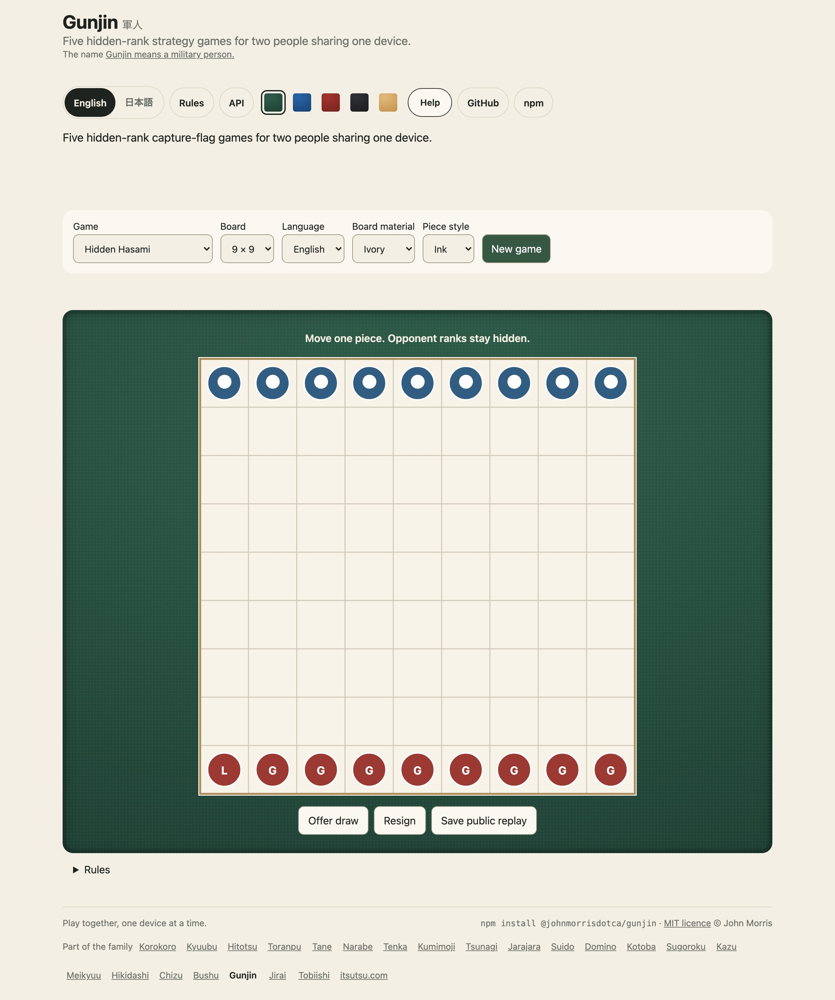
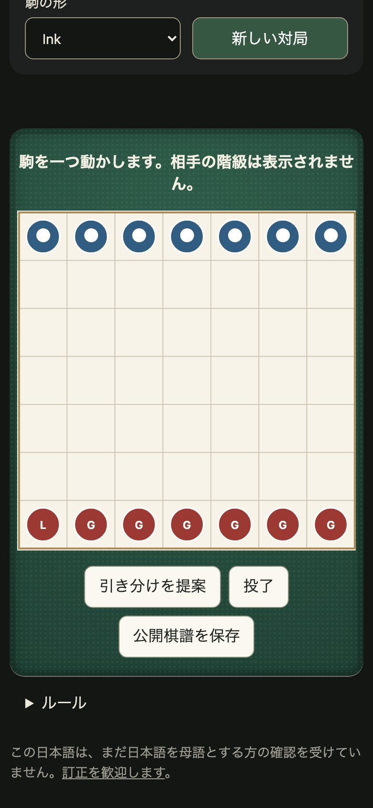

<h1 align="center">Gunjin <sub>軍人</sub></h1>

<p align="center"><strong>Five hidden-rank strategy games, played face to face on one device.</strong><br>
A typed, immutable game engine and a private pass-the-device browser player, in English and Japanese.</p>

<p align="center">
  <a href="https://github.com/johnmorrisdotca/gunjin/actions/workflows/ci.yml"></a>
  <a href="https://www.npmjs.com/package/@johnmorrisdotca/gunjin"></a>
  <a href="./LICENSE"></a>
  
  
</p>

<p align="center"><a href="https://johnmorrisdotca.github.io/gunjin/"><strong>Play the demo →</strong></a> · <a href="https://johnmorrisdotca.github.io/gunjin/api.html">API reference</a> · <a href="docs/RULES.md">Rules and adaptations</a></p>

<p align="center">
  
  
</p>

Gunjin brings five hidden-rank strategy games together behind one small API:
Hidden Hasami, Luzhanqi Mini, Salpakan Classic, Hidden Capture Flag, and
Gunjin Shogi · Club Rules. The rules and adaptations are documented in
[Rules](docs/RULES.md); each mode is named plainly where it differs from a
traditional ruleset.

## In 30 seconds

```sh
npm install @johnmorrisdotca/gunjin
```

```ts
import { createHasamiMatch, hasamiRoster } from "@johnmorrisdotca/gunjin/hasami";
import { viewForPlayer } from "@johnmorrisdotca/gunjin/views";

const match = createHasamiMatch({ width: 7, height: 7 });
console.log(hasamiRoster(7)); // one leader and six guards
console.log(viewForPlayer(match, 0).phase); // "setup"
```

A complete setup is submitted through the trusted mode entry point, one
player at a time. The browser player takes an authoritative match and handles
private setup, device handoff, play, and public replay download:

```ts
import { createHasamiMatch } from "@johnmorrisdotca/gunjin/hasami";
import { mountGunjin } from "@johnmorrisdotca/gunjin/play";

const match = createHasamiMatch({ width: 7, height: 7 });
const game = mountGunjin(document.querySelector("#game")!, match, {
  language: "en",
  material: "wood",
  pieceStyle: "tiles",
});
// Call game.destroy() when the page removes the game.
```

The container should have a width and a positioned layout. For a working
match, each side must submit a valid roster before play begins. The
[demo](https://johnmorrisdotca.github.io/gunjin/) shows the full flow.

## Who it is for

- **Board-game projects** that need rules and validation separate from the UI.
- **Local game nights** that want a private setup and handoff on one screen.
- **Teachers and clubs** comparing five related hidden-rank rule adaptations.
- **Web developers** who want an SVG renderer or a small typed engine without
  adopting a UI framework.

## Features

- **Five hidden-rank games**, each a typed, immutable engine: Hidden Hasami, Luzhanqi Mini, Salpakan Classic, Hidden Capture Flag and Gunjin Shogi · Club Rules, each named plainly where it adapts a traditional ruleset.
- **Play locally.** Two people arrange their pieces privately and pass one
  device between turns. Opposing ranks stay hidden in the player view.
- **Build your own interface.** Pure functions create matches, validate
  setups and moves, and produce redacted views and public replays.
- **Choose a look.** The browser player supports English or Japanese, three
  board materials, and two piece styles.
- **Role-safe by design.** Views, public positions and replay records never carry a hidden rank that the rules keep from the other side; the full match is for trusted host code only.
- **Use it anywhere.** Typed ES modules, no runtime dependencies, and no
  framework requirement.

## Use it in your project

The browser player is `mountGunjin` from `@johnmorrisdotca/gunjin/play`, and the rules of each mode are in an entry of its own:

| Import | Use |
| --- | --- |
| `@johnmorrisdotca/gunjin` | Redacted views, public replay, shared types, drawing and styling exports |
| `@johnmorrisdotca/gunjin/hasami` | Hidden Hasami match creation, roster, setup and moves |
| `@johnmorrisdotca/gunjin/luzhanqi-mini` | Luzhanqi Mini match creation, roster, setup and moves |
| `@johnmorrisdotca/gunjin/salpakan` | Salpakan Classic match creation, roster, setup and moves |
| `@johnmorrisdotca/gunjin/stratego-lite` | Hidden Capture Flag rules and engine functions |
| `@johnmorrisdotca/gunjin/gunjin-shogi` | Gunjin Shogi rules and engine functions |
| `@johnmorrisdotca/gunjin/trusted` | Generic engine, setup, turns, and full-match serialization for trusted host code |
| `@johnmorrisdotca/gunjin/views` | Player and spectator redaction, legal move coordinates, board features |
| `@johnmorrisdotca/gunjin/draw` | SVG board drawing |
| `@johnmorrisdotca/gunjin/play` | Pass-the-device browser player |

The five rulesets and their adaptations are described in
[docs/RULES.md](docs/RULES.md). Signatures and types are listed in the
[API reference](https://johnmorrisdotca.github.io/gunjin/api.html) and
[docs/API.md](docs/API.md).

## API

Every export of every entry point is in the [API reference](https://johnmorrisdotca.github.io/gunjin/api.html), made from the source when the demo is built, and in [docs/API.md](docs/API.md). The calls you will use first:

| Function | Purpose |
| --- | --- |
| `createHasamiMatch(size?)`, `createLuzhanqiMiniMatch()`, `createSalpakanMatch()` | Create mode-specific matches |
| `createMatch(mode, size?)` | Create any supported match from the trusted entry point |
| `rosterForSetup(match, player)` and mode roster functions | Read the current player's piece roster |
| `submitSetup(match, player, placements, expectedSetupStep)` | Validate and submit a private setup immutably |
| `playMove(match, player, { from, to, expectedTurn })` | Validate and apply a move immutably |
| `viewForPlayer(match, player)`, `publicPosition(match)` | Return role-redacted views |
| `publicReplay(match)`, `encodePublicReplay(match)`, `decodePublicReplay(json)` | Create, encode, and validate role-safe replay records |
| `drawGunjinBoard(view, options?)`, `mountGunjin(element, match, options?)` | Draw SVG or mount the local player |

Calls that make or change a full match belong in trusted host code. Never
send a full `AuthoritativeMatch` or trusted serialization to an opponent.
The local browser player is intended for casual, same-device hotseat play;
a person with access to the browser process can inspect its memory.

## Theming

`mountGunjin(element, match, options?)` accepts:

| Option | Values | Purpose |
| --- | --- | --- |
| `language` | `"en"`, `"ja"` | Interface language |
| `material` | `"ivory"`, `"wood"`, `"slate"` | Board palette |
| `pieceStyle` | `"ink"`, `"tiles"` | Circular or square piece marks |
| `onChange` | `(position: PublicPosition) => void` | Receive redacted public position updates |
| `onFinish` | `(result: { winner: Player \| null; reason: string }) => void` | Receive a finished result |

The returned handle provides `view()`, `replay()`, `set(options)`, and
`destroy()`. `drawGunjinBoard(view, options?)` returns SVG text and accepts
`language`, `material`, `pieceStyle`, `selected`, `targets`, and setup `draft`
options. See [docs/API.md](docs/API.md) for the typed details.

The player's own styles are scoped under the `.gj-root` class; its text, buttons and handoff panel take
their colours from the page's `--kz-ink` and `--kz-paper` custom properties when the page
sets them, so one line of CSS on a parent changes both.

## Limits

The browser player is local hotseat, not an online service. Trusted engine
matches contain both sides' hidden ranks; `PlayerView`, `PublicPosition`, and
public replay records redact roles according to each ruleset. Capture Flag
battle history intentionally reveals both combat ranks. The trusted
serialization is for private host storage, not encrypted storage or a
network protocol. This package provides no matchmaking, account system, or
remote transport.

## Browser support

Any current browser with SVG and ES modules: Chrome, Edge, Firefox and Safari, on a phone or a desk. The demo's tests run in Chromium and WebKit at a phone's width and a desk's, on this Mac and in the Linux image CI uses.

## Languages

The player's words are English and Japanese, chosen with the `language` option. Corrections to the Japanese are welcome as issues.

## Roadmap

The package is an engine and a same-device player, and the limits above are meant: no accounts, matchmaking or network transport. Nothing else is promised for a date; ideas are welcome in the [issues](https://github.com/johnmorrisdotca/gunjin/issues).

## Architecture

```text
src/
├── draw.ts
├── gunjin-shogi.ts
├── hasami.ts
├── index-core.ts
├── index.ts
├── luzhanqi-mini.ts
├── match.ts
├── play.ts
├── replay.ts
├── rules/
│   ├── board.ts
│   ├── gunjinShogi.ts
│   ├── hiddenHasami.ts
│   ├── index.ts
│   ├── luzhanqiMini.ts
│   ├── salpakan.ts
│   ├── strategoLite.ts
│   └── types.ts
├── salpakan.ts
├── stratego-lite.ts
├── strings.ts
├── style.ts
├── trusted.ts
├── types.ts
└── views.ts
```

## The name

*Gunjin* (軍人) is Japanese for a soldier or military person, read ぐんじん, said in three beats, *gun-ji-n*. It is
the first word of 軍人将棋 (*gunjin shōgi*), "soldier chess", the hidden-rank Japanese army game that gives the
package its name and one of its five modes. ([Wiktionary: 軍人](https://en.wiktionary.org/wiki/軍人).)

## Where it comes from

Gunjin Shogi (軍人将棋) is the Japanese hidden-rank army game that names the package, and the other four modes are in the same family of hidden-rank games: Hasami Shogi, Luzhanqi, Salpakan and Stratego. Their rules are common property, and each mode here is written in its own words and called an adaptation wherever it departs from a traditional ruleset. The sources are listed under References in [docs/RULES.md](docs/RULES.md).

### The family

<!-- family:start (made by scripts/family-readme.mjs from scripts/family-template.mjs; change those, not this) -->
Gunjin is one of twenty-four packages, each made for the same site, each at
[github.com/johnmorrisdotca](https://github.com/johnmorrisdotca). The code of every one is MIT.

- [Korokoro](https://github.com/johnmorrisdotca/korokoro) (コロコロ): dice, with notation, exact odds, real sounds and the dice of many games. [Demo](https://johnmorrisdotca.github.io/korokoro/).
- [Kyuubu](https://github.com/johnmorrisdotca/kyuubu) (キューブ): a turning cube for the browser, 2×2 to 7×7, with record solves to replay. [Demo](https://johnmorrisdotca.github.io/kyuubu/).
- [Hitotsu](https://github.com/johnmorrisdotca/hitotsu) (一つ): a colour-card shedding game for two to eight, with the house rules people play. [Demo](https://johnmorrisdotca.github.io/hitotsu/).
- [Toranpu](https://github.com/johnmorrisdotca/toranpu) (トランプ): a deck of playing cards, card games with computer players, and solitaires. [Demo](https://johnmorrisdotca.github.io/toranpu/).
- [Tane](https://github.com/johnmorrisdotca/tane) (種): seeded random numbers and daily seeds, the same in every browser and on every server. [Demo](https://johnmorrisdotca.github.io/tane/).
- [Narabe](https://github.com/johnmorrisdotca/narabe) (並べ): one rules engine for abstract board games, from gomoku and Reversi to Go and checkers. [Demo](https://johnmorrisdotca.github.io/narabe/).
- [Tenka](https://github.com/johnmorrisdotca/tenka) (天下): world conquest for two to six, on a map of the real world. [Demo](https://johnmorrisdotca.github.io/tenka/).
- [Kumimoji](https://github.com/johnmorrisdotca/kumimoji) (組み文字): a crossword tile race, in English and Japanese kana. [Demo](https://johnmorrisdotca.github.io/kumimoji/).
- [Tsunagi](https://github.com/johnmorrisdotca/tsunagi) (繋ぎ): a line-joining logic puzzle whose every level has exactly one answer. [Demo](https://johnmorrisdotca.github.io/tsunagi/).
- [Jarajara](https://github.com/johnmorrisdotca/jarajara) (ジャラジャラ): mahjong tiles drawn as SVG, stacked layouts, and the matching solitaire Awase. [Demo](https://johnmorrisdotca.github.io/jarajara/).
- [Suido](https://github.com/johnmorrisdotca/suido) (水道): a pipe puzzle: turn the pieces until the water reaches every drain. [Demo](https://johnmorrisdotca.github.io/suido/).
- [Domino](https://github.com/johnmorrisdotca/domino) (ドミノ): dominoes and Mexican Train. [Demo](https://johnmorrisdotca.github.io/domino/).
- [Kotoba](https://github.com/johnmorrisdotca/kotoba) (言葉): word lists and word-game rules in English, French, German and Japanese. [Demo](https://johnmorrisdotca.github.io/kotoba/).
- [Sugoroku](https://github.com/johnmorrisdotca/sugoroku) (双六): backgammon and its variants, with the doubling cube and match play. [Demo](https://johnmorrisdotca.github.io/sugoroku/).
- [Kazu](https://github.com/johnmorrisdotca/kazu) (数): grid number puzzles: Sudoku and its variants, Futoshiki and Skyscrapers. [Demo](https://johnmorrisdotca.github.io/kazu/).
- [Meikyuu](https://github.com/johnmorrisdotca/meikyuu) (迷宮): mazes on squares, hexagons, triangles and circles, made from a seed and drawn through with a finger or the mouse. [Demo](https://johnmorrisdotca.github.io/meikyuu/).
- [Hikidashi](https://github.com/johnmorrisdotca/hikidashi) (引き出し): a drawer of small Japanese text tools: era dates, kanji numerals, readings and sentence difficulty. [Demo](https://johnmorrisdotca.github.io/hikidashi/).
- [Chizu](https://github.com/johnmorrisdotca/chizu) (地図): maps of the world and of countries' regions, in English and Japanese, with a quiz and callouts. [Demo](https://johnmorrisdotca.github.io/chizu/).
- [Bushu](https://github.com/johnmorrisdotca/bushu) (部首): find a kanji by the parts it is made of. [Demo](https://johnmorrisdotca.github.io/bushu/).
- [Tobiishi](https://github.com/johnmorrisdotca/tobiishi) (飛び石): peg solitaire with nine boards and seeded solvable challenges. [Demo](https://johnmorrisdotca.github.io/tobiishi/).
- [Jirai](https://github.com/johnmorrisdotca/jirai) (地雷): minesweeper on shaped grids with verified no-guess boards. [Demo](https://johnmorrisdotca.github.io/jirai/).
- [Gunjin](https://github.com/johnmorrisdotca/gunjin) (軍人): five hidden-rank strategy games with pass-the-device play. [Demo](https://johnmorrisdotca.github.io/gunjin/).
- [Karakuri](https://github.com/johnmorrisdotca/karakuri) (からくり): eight hyper-casual puzzle games, some of them physics: draw a shield, pull pins, cut ropes, slide blocks, pour tubes. [Demo](https://johnmorrisdotca.github.io/karakuri/).
- [Houseki](https://github.com/johnmorrisdotca/houseki) (宝石): gem and stone matching puzzles: falling triplets, stone collapse, colour chains and gem swap. [Demo](https://johnmorrisdotca.github.io/houseki/).

**This package is Gunjin.** The demos of all twenty-four share one header and footer, so each links the rest.
<!-- family:end -->

## Development

```sh
pnpm install
pnpm check          # lint, types, tests and the presentation checks
pnpm test:package   # pack it as npm does, install it in an empty project, import every entry
pnpm test:demo      # build the demo and play it in a real browser, at a phone's width and a desk's
pnpm pictures       # retake the two pictures above
```

See [CONTRIBUTING.md](CONTRIBUTING.md) for the project conventions and checks.

## Contributing

Bug reports and pull requests are welcome in the [issues](https://github.com/johnmorrisdotca/gunjin/issues). Please read
[CONTRIBUTING.md](CONTRIBUTING.md) and the [Code of Conduct](CODE_OF_CONDUCT.md). To report a security concern privately,
follow [SECURITY.md](SECURITY.md).

## Changes

Every release is written up in [CHANGELOG.md](./CHANGELOG.md).

## Licence

[MIT](./LICENSE) © John Morris.
